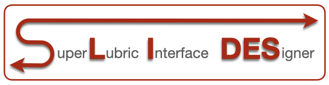

.. MD_rigid documentation master file, created by
   sphinx-quickstart on Mon May  1 18:21:20 2023.
   You can adapt this file completely to your liking, but it should at least
   contain the root `toctree` directive.

SuperLubric Interface DESigner
==============================

Compute the interlocking potential between a periodic substrate and a finite-size adsorbate, in the rigid approximation.
The adsorbate is treated as a rigid body with a given orientation :math:`\theta` and center of mass (CM) position :math:`x_\mathrm{cm}, y_\mathrm{cm}`.
This model mimicks the basic physics of 2D materials flakes sliding over a substrate in AFM experiments, e.g. graphene on graphite, nobel gases islands on metal surfaces, and colloidal particles under external drivers, like gravity.

The rigid approximation allows for treatment of large clusters approaching sizes of AFM experiments. This is of course a major approximation, and yet a reasonable one to qualitatively describe the contact between stiff materials like graphite and hBN.
The large-scale capabilities and qualitative description, make SLIDES the perfect tool to explore interafaces at little computational cost and derive scaling laws as a function of the system paramters, e.g. cluster size or substrate potential.
To the best of our knowledge, no such tool is available today: LAMMPS can be used for common cases for which the interaction potentials are available (e.g. graphene/hBN) and homemade ad-hoc solution are adopted elsewhere.

This package is a collection of functions implementing the above physical system and automating routines usually needed to study the static, dynamics and scaling laws of friction at nanoscale interfaces.
SLIDES is not object oriented, but mainly based on function. This choice stems from the will to keep the software as simple as possible, easy to extend and allow single parts of the code to be easily integrated in other projects.
The two main components of this package are ``tool_create_substrate.py`` and ``tool_create_cluster.py``.
The first module allows to create a set of rigid substrates of different symmetry and Fourier complexity.
The second module provides a set of function to create finite clusters of different shapes.
The ``static_[...].py``  modules combine substrate and cluster to compute static energy landscapes, providing a convenient and automated interface for systematic explorations. The command line interface provides a simple parallelisation over clusters of different sizes, ideal to compute scaling laws.
The ``MD_rigid_rototrasl.py`` module performes Euler intergration of the overdamped Langeving equation.

This software was developed at SISSA, Trieste, Italy in the group of Prof.
Erio Tosatti and Andrea Vanossi and based on the experiments by Xin Cao and Clemens Bechinger at Univeristy of Konstanz, Germany.
For any question/support contanct `Andrea Silva <ansilva@sissa.it>`_.

.. toctree::
   :maxdepth: 3

   intro
   installation
   examples
   modules

Indices and tables
==================

* :ref:`genindex`
* :ref:`modindex`
